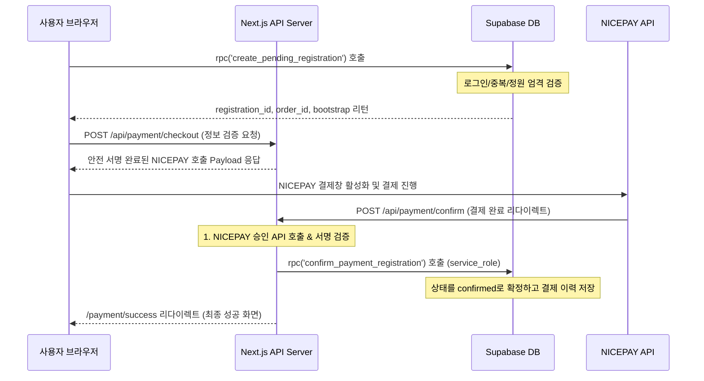

# 🏡 이요하우스 (IYOHOUSE)

이요하우스는 독립 창작자 커뮤니티 공간이자, 창작 활동과 시각적 실험을 돕는 다양한 워크숍을 기획 및 운영하는 공간입니다.
본 웹 서비스는 단순한 소개용 포트폴리오 사이트를 넘어, 이요하우스의 멤버 구성원을 소개하고 **워크숍 상세 정보를 조회, 신청, 그리고 실시간 NICEPAY 결제 및 안내 메일 수신**까지 전 과정을 안전하게 처리하는 **실제 운영용 워크숍 플랫폼**입니다.

---

## 🛠️ 기술 스택 (Tech Stack)

* **Frontend**: Next.js (App Router), React, TypeScript, Vanilla CSS (좌표계 기반 동적 격자선 시스템)
* **Backend & Database**: Supabase (PostgreSQL, Supabase Auth, Row Level Security, Database Migrations & RPCs)
* **Content Management System (CMS)**: Sanity.io (워크숍의 텍스트, 이미지, 태그 등 가변 콘텐츠 관리)
* **Payment Gateway**: NICEPAY (나이스페이 결제 통합 모듈 API)
* **Email Service**: Resend (결제 승인 성공 안내 및 신청 결과 이메일 전송)
* **Deployment & Environments**: Vercel (Next.js Application), Supabase Cloud (Database Hosting)

---

## 💡 주요 기능 (Key Features)

1. **워크숍 목록 및 상세 조회**: Sanity CMS와 연동하여 실시간으로 등록된 워크숍 정보를 격자 레이아웃에 맞춰 불러옵니다.
2. **소셜 인증 로그인 (OAuth)**: Supabase Auth를 활용하여 Google 및 Kakao 간편 로그인을 지원하며, `@supabase/ssr` 기반 세션 상태를 유지합니다.
3. **가입자 온보딩 관리**: 최초 로그인 시 이름과 연락처가 비어 있는 경우 온보딩 페이지로 강제 리다이렉트하여 프로필 완성을 의무화합니다.
4. **실시간 워크숍 신청 및 정원 관리**: DB 트랜잭션 단위로 수용 정원 초과 여부와 중복 신청 여부를 실시간 검사합니다.
5. **NICEPAY 결제 연동**: 카카오페이, 토스페이, 신용카드, 계좌이체 등 다양한 결제 수단을 안전하게 지원합니다.
6. **안내 메일 자동 발송**: 결제 승인이 완료되는 즉시 가입자에게 Resend API를 통해 신청 상세 메일을 발송합니다.
7. **관리자 기능 (로드맵 예정)**: 신청자 목록 수동 제어, 정원 수정, 환불 처리 대시보드를 추가할 예정입니다.

---

## 📐 전체 아키텍처 구조 (System Architecture)

```mermaid
graph TD
    User[사용자 브라우저] <--> NextJS[Next.js App Router (Vercel)]
    NextJS <--> Sanity[Sanity CMS (워크숍 데이터)]
    NextJS <--> Supabase[Supabase DB / Auth / RLS]
    NextJS <--> Nicepay[NICEPAY API (결제 검증/승인)]
    NextJS --> Resend[Resend API (이메일 안내)]
```

* **데이터 연동 구조**: Next.js가 클라이언트로부터 데이터 요청을 받으면, Sanity API를 통해 워크숍 본문 데이터를 가져오고, Supabase에서 해당 워크숍의 실시간 신청/결제 확정 건수를 가져와 조합한 뒤 렌더링합니다.
* **보안 격리 구조**: 결제 승인과 같은 민감한 처리는 브라우저를 거치지 않고, Next.js API Route 서버와 Supabase Database RPC(`service_role` 권한 제한)가 직접 통신하여 데이터 변조를 원천 차단합니다.

---

## 🚀 로컬 실행 방법 (Local Setup)

### 1. 패키지 설치
```bash
npm install
```

### 2. 로컬 환경 변수 설정
프로젝트 루트 폴더에 `.env.local` 파일을 생성하고 아래의 환경 변수 규격을 채워 넣습니다.
```bash
cp .env.example .env.local
```

### 3. 개발 서버 실행
```bash
npm run dev
```
기본적으로 `http://localhost:3000` (또는 활성 포트에 따라 `3001` 등)에서 개발 서버가 기동됩니다.

---

## 🔑 환경변수 설명 (Environment Variables)

프로젝트 구동에 필요한 필수 환경변수 목록입니다. 보안상 실제 시크릿 키는 절대 커밋하지 마십시오.

| 변수명 | 목적 및 용도 |
| --- | --- |
| `NEXT_PUBLIC_SUPABASE_URL` | Supabase 프로젝트의 고유 API 엔드포인트 URL입니다. |
| `NEXT_PUBLIC_SUPABASE_ANON_KEY` | 클라이언트 브라우저에서 안전하게 호출할 수 있는 Supabase 익명 퍼블릭 키입니다. |
| `SUPABASE_SERVICE_ROLE_KEY` | **[서버 전용]** RLS 정책을 무시하고 전체 DB를 다룰 수 있는 시크릿 서비스 롤 키입니다. |
| `IYO_NICEPAY_ENABLED` | NICEPAY 결제 모듈 활성화 여부 플래그 (`true` / `false`) |
| `IYO_NICEPAY_MODE` | 결제 연동 모드 (`test` 또는 `production`) |
| `IYO_NICEPAY_CLIENT_KEY` | NICEPAY 클라이언트 사이드 SDK 호출 시 식별자로 사용하는 클라이언트 키입니다. |
| `IYO_NICEPAY_SECRET_KEY` | **[서버 전용]** NICEPAY 승인 API 호출 시 본인 인증 및 SHA256 서명 서명용으로 사용되는 비밀키입니다. |
| `RESEND_API_KEY` | **[서버 전용]** 이메일 발송 서비스인 Resend 인증에 사용되는 API 비밀키입니다. |

---

## 🗄️ DB & Supabase 세팅 (Database Setup)

본 프로젝트는 Supabase PostgreSQL 인프라를 사용하며, 로컬 CLI 마이그레이션 도구로 스키마를 관리합니다.

### 1. 마이그레이션 적용
로컬 Supabase CLI가 설치된 경우 아래 명령으로 로컬/원격 DB에 최신 스키마 및 RLS 정책을 적용할 수 있습니다.
```bash
# 원격 데이터베이스에 마이그레이션 강제 푸시
supabase db push
```

### 2. RLS (Row Level Security) 정책
* `workshop_registrations_v2` 테이블에 엄격한 RLS가 걸려 있습니다.
* 일반 `authenticated` 사용자는 오직 본인이 신청한 등록 건(`user_id = auth.uid()`) 및 본인의 프로필(`profiles.id = auth.uid()`)만 `SELECT` 및 `UPDATE` 할 수 있습니다.
* 클라이언트(브라우저) 환경에서 이 테이블에 직접 `INSERT` 하는 것은 RLS 및 계약상 금지됩니다.

### 3. 주요 Database RPC 함수
데이터 무결성 보장을 위해 주요 트랜잭션은 DB 내부 SQL 프로시저(RPC)로 처리되며 `SECURITY DEFINER` 권한을 가집니다.
* **`create_pending_registration(p_workshop_id UUID)`**:
  - 호출자(`auth.uid()`)가 로그인했는지, 온보딩 프로필(`full_name`, `phone`)을 입력했는지 즉시 검사합니다.
  - 해당 워크숍에 이미 `pending` 또는 `confirmed` 상태로 등록된 이력이 있는지 중복을 방지합니다.
  - 워크숍 정원 초과 여부를 동시성 제어 하에(Row Lock) 엄격히 검사하고, 통과하면 `pending` 상태(10분 유효 시간 부여)의 레코드 및 결제 고유 `order_id`와 `amount`를 임시 생성하여 JSONB로 반환합니다.
* **`confirm_payment_registration(p_registration_id UUID, p_payment_key TEXT, p_order_id TEXT, p_amount INTEGER)`**:
  - `PUBLIC` 권한이 박탈되어 있고 오직 **`service_role` 관리자 클라이언트만 실행**할 수 있습니다.
  - NICEPAY 승인이 완료된 후, 해당 등록 건의 상태를 `pending`에서 `confirmed`로 업데이트하고 `payments` 테이블에 실제 결제 내역(PG 거래 키, 실제 승인액 등)을 저장하는 안전한 마무리 처리용 RPC입니다.

---

## 💳 결제 플로우 (Payment Flow)

사용자가 워크숍을 신청하고 결제를 완료하기까지의 내부 라이프사이클은 다음과 같이 통제됩니다.



1. **Pending (임시 대기)**: 워크숍 신청 시 `create_pending_registration`을 호출하여 DB에 `status: pending` 상태의 임시 신청 행을 만듭니다. (10분 내에 결제가 성공하지 않으면 자동 만료)
2. **Checkout (주문 검증)**: 생성된 `registration_id`를 Next.js 서버 `/api/payment/checkout` API로 전송하여, 해당 결제가 조작되지 않았는지 서버가 소유권과 금액을 검증하고 NICEPAY 암호화 payload를 생성해 브라우저에 반환합니다.
3. **Confirm (PG 승인 및 확정)**: NICEPAY 결제 모듈 통신 후 서버 라우트 `/api/payment/confirm`가 응답을 가로채 결제 유효성 및 금액 서명을 한 번 더 검증하고, NICEPAY 승인 API를 서버-투-서버로 최종 통신한 뒤 Supabase 관리자 권한을 활용해 `confirm_payment_registration` RPC를 수행해 `status: confirmed`로 상태를 영구 확정합니다.
4. **Success / Fail (완료 화면)**: 최종 결제 이행 완료 후 유저는 `/payment/success`로 리다이렉트되어 완료 메시지를 확인하며, 도중 취소나 에러 발생 시에는 `/payment/fail`을 경유하여 해당 pending 내역이 `cancelled` 상태로 롤백됩니다.

---

## 📦 배포 방법 (Deployment Guide)

### 1. Frontend & API (Vercel)
- Vercel에 GitHub 저장소를 임포트합니다.
- Vercel Project Settings에서 [환경변수 설명](#-환경변수-설명-environment-variables) 표에 기술된 모든 환경변수를 주입합니다.

### 2. Database (Supabase)
- Supabase Cloud 콘솔에서 새 프로젝트를 생성합니다.
- Local CLI 환경에서 원격 Supabase 프로젝트와 로그인 및 연동을 마친 후 마이그레이션 스키마 및 RPC들을 최종 동기화합니다.
  ```bash
  supabase login
  supabase link --project-ref <your-project-ref>
  supabase db push
  ```

### 3. CMS (Sanity)
- Sanity 프로젝트 세팅에서 CORS Origins 설정에 Vercel 배포 URL 및 로컬 개발용 URL(`http://localhost:3000`)을 추가하여 API 차단이 일어나지 않게 허용해 줍니다.
- 로컬 Sanity 디렉토리에서 콘텐츠 스튜디오를 배포합니다.
  ```bash
  npx sanity deploy
  ```

### 4. PG 가맹점 설정 (NICEPAY)
- NICEPAY 상점 관리자 콘솔에 접속하여 상점 도메인 및 결제 결과 수신용 리턴 통신 URL을 Vercel에 배포된 서버 주소(`/api/payment/webhook` 및 `/api/payment/confirm`)로 정상 설정 및 등록합니다.

---

## 🗺️ 향후 로드맵 (Roadmap)

* [ ] **관리자 페이지(Admin Dashboard)**: 관리자가 웹 브라우저에서 워크숍 신청 명단을 한눈에 모니터링하고, 수동 취소 및 전액/부분 환불 명령을 안전하게 내릴 수 있는 사내 관리 도구 개발.
* [ ] **종합 유닛/통합 테스트 구축**: NICEPAY 결제 실패 시나리오 및 DB RPC 동시성 초과 정원 제어에 대한 Playwright 및 Jest 기반 통합 테스트 도구 추가.
* [ ] **데이터 캐싱 최적화**: Sanity CMS API 및 Supabase 실시간 인원 카운트 데이터 패치 속도를 개선하기 위한 Next.js ISR(Incremental Static Regeneration) 도입.
* [ ] **Strict Type Definition**: 코드베이스 전반에 산재한 dynamic `any` 타입들을 제거하고, Supabase DB 스키마로부터 자동 생성된 TypeScript 인터페이스를 연동하여 완전한 타입 안정성 확보.
